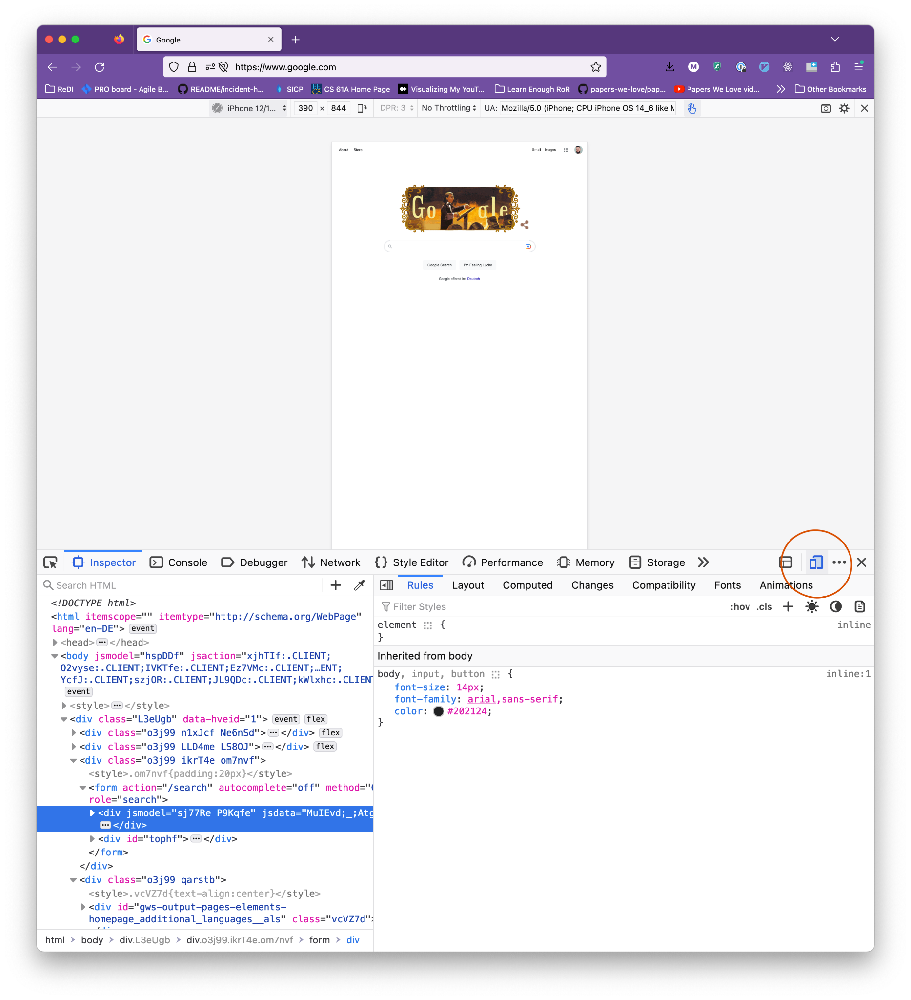

# Responsive Design

In this lesson, we will learn the basics of responsive web design. This is a fundamental concept in the modern web development and deserves special attention.

## Agenda

1. Introduction
2. Relative Units
3. Testing Responsive Designs
4. Responsive images
5. Exercise

## 1. Introduction

Responsive web design is about creating web pages that look good on all devices! A responsive web design will automatically adjust for different screen sizes and viewports.

That is achieved by using such HTML and CSS that makes the web elements shrink, resize or enlarge themselves on different screen sizes.

It is important to understand that responsive web design isn't a separate technology — it is a term used to describe an approach to web design or a set of best practices, used to create a layout that can respond to the device being used to view the content. These approaches can include

- Making containers fluid by setting `max-width: 100%`
- Using relative units for typography (`em`, `rem`)
- Using CSS Flexbox or CSS Grid to create responsive layouts
- Using media queries to change styles on different viewports

## 2. Relative Units

Relative units are _relative_ to other content on the page. That means that their size is based on the size of something else, usually their parent element.

`%`, `em`, and `rem` are three common helpful units:

- `%` = "Take up % of the parent container"
  - Example: parent element is 400px wide, setting 50% width on the child makes its width 200px
- `em` = "The font size of the parent element (for properties other than font-size) or this element itself (for font-size)"
  - In other words: if you set an element's font-size property like `font-size: 1em`, that means "the same font size as the parent element." If you set any other property like `width: 1em`, that means "the same as this element's font size."
  - Example: parent element has 16px font size, setting `font-size: .75em` on the child makes its font-size 12px
  - Example: parent element has 16px font size, setting `margin: .75em` on the child creates a 12px margin around the element
  - Example: parent element has 16px font size, element itself has `font-size: 12px`. Setting `margin: .75em` on the element itself creates a 9px margin around the element
- `rem` = The font size of the "root element", <html>
  - If you have CSS properties with values set in rem and you change the font size on the <html> element, those elements will adapt!
  - Most browsers have a default font-size of `16px`, so if you don't change this, `1rem` = `16px`

## 3. Testing Responsive Designs

It is extremely important to look at the result of your implementation directly in the browser. As you have already learned, the browser Dev Tools are an excellent way to check and debug your html and css code.

What's more, the browser Dev Tools allow you to check how your page is going to look on different devices such as tablets or mobile phones. Sometimes you can even select from a few built-in device sizes. Use the Dev Tools to check out how your website looks on mobile devices.

  

    <h3>Chrome:</h3>
    
  

  

    <h3>Firefox:</h3>
    
  

## 4. Responsive images

"Responsive images" means having images that look good on all different devices and viewport widths.

Making images look good at all sizes is often a matter of setting their `width` or `max-width` to `100%`, and possibly wrapping them in a `
`.

Here are a few common problems with images and how you can solve them:

- Problem: Image is blurry

  - Usually means the image is small and being displayed at a large size
  - Important: the "actual" image size is not the same as size shown in browser
  - How can you know the "actual" size? Download the image and check!

- Image is stretched or warped

  - Usually because one dimension (height/width) of the image is hardcoded and the other is not

- Image does not change size with page/container

  - Usually because image uses a px width instead of %

- Image is cut off/overflows the container

  - Lots of possible reasons. Might need `width` or `max-width`, or you could use the `object-fit` and `object-position` CSS properties

- Image set using `background-image: url(...)` is not showing the correct part of the image
  - Use a combination of `background-size` and `background-position` properties to resize and reposition it

## 5. Exercise

Solve all of the problems in [this CodePen](https://codepen.io/redi-school/pen/OJBQwON)!

# Glossary & Terminology

- `Responsive Web Design` - Responsive web design (RWD) is an approach to web design that makes web pages look well on a variety of devices and window or screen sizes from minimum to maximum display size. More info [here](https://en.wikipedia.org/wiki/Responsive_web_design).
- Breakpoint: The point at which the layout changes
- [Viewport](https://www.w3schools.com/css/css_rwd_viewport.asp): The user's visible area of a web page

# Homework

For the following 3 websites, use your browser’s dev tools to change the viewport width widths and make a list of as many changes as you can spot at different widths (layout, font size, navigation, etc.):

- [Wikipedia](https://en.wikipedia.org/wiki/Main_Page)
- [MDN HTML docs](https://developer.mozilla.org/en-US/docs/Web/HTML)
- [YouTube](https://youtube.com)

# Resources

- [MDN Responsive Design](https://developer.mozilla.org/en-US/docs/Learn/CSS/CSS_layout/Responsive_Design)
- [W3S Responsive Design](https://www.w3schools.com/html/html_responsive.asp)

# Slides

<iframe src="https://docs.google.com/presentation/d/e/2PACX-1vQO1aoZVE0Bv6zOUqhvPd4gM-XnyPErkzbQljQsj7zLRHtKr6NkSmXGAhs9iLzwGKilQX45D5TCFFzX/embed" frameborder="0" width="960" height="569" allowfullscreen="true" mozallowfullscreen="true" webkitallowfullscreen="true"></iframe>
