# Visual Studio Code + Writing HTML & CSS Locally

## Class Agenda

1. Introduction
1. Applications, Files, and Folders
1. Setting Up VSCode
1. Creating a Folder for this Class
1. Creating Files in Your Folder
1. Introducing the `<!DOCTYPE html>`, `<html>`, `<head>`. and `<body>` Tags
1. Linking HTML and CSS files together
1. Viewing Your New Page

## Introduction

So far in this class, we've used CodePen to write and share our HTML and CSS code. CodePen is a great way to get started quickly writing HTML and CSS, but it has some limitations!

The biggest limitation is that you can only have one "page" at a time. Most websites have many pages - a homepage, an about page, articles, videos, and much more.

This means the people who develop those websites (that's you!) need to be able to write code for many different pages at the same time.

To do that, developers use a _text editor_ like Visual Studio Code, or VSCode for short.

Today, we're going to move from using CodePen to write and store our HTML and CSS to using VSCode. To get started, let's learn about _applications_, _files_, and _folders_.

## Applications, Files, and Folders

### Applications

What is an application? You've probably heard the term "app" or "application" for the things you install and use on your phones. Gmail, WhatsApp, Ebay Kleinanzeigen, Spotify - these are all applications you can install on your phone.

The work "application" can also refer to things you install on a laptop. The web browser (like Chrome, FireFox, Edge, or Safari) you use to access course materials and visit CodePen is an example of an application on your laptop. Slack is another application you may have already installed.

VSCode is an example of a type of application called a _text editor_ or _code editor_. It's designed for just that: editing code. You can use it to edit HTML, CSS, JavaScript, Ruby, Python, and many other coding languages.

But what code are you editing? To understand that, we need to understand _files_.

### Files

What is a file? It's simply a way of storing information. Everything stored on a computer is in a file. For example, if you download a PDF sent to you in an email, you are storing a file on your computer.

And files have types! A PDF is one type of file (PDF stands for "portable document format"). A `.mp3`, which is the most common file type for songs, is another one. And there are two file types that are especially important for us: `.html` and `.css`!

To interact with files, we usually use applications. You can use an application to _open_ a particular file. Most applications are designed to open only certain types of applications. For example, if you wanted to edit a picture, you would open it with a photo editing application.

One file can be opened by many different applications. In our case, we will open our `.html` and `.css` with VSCode to edit them, and we will open them with a web browser to view them.

For more on files, see [this helpful guide](https://www.computerhope.com/jargon/f/file.htm).

### Organizing files

Files are organized by being stored in _folders_. A folder is just a way of grouping files. To create a multi-page website, you might need dozens or even hundreds of files. It's important to keep those files organized so that you can find them easily in the future!

You can also have folders inside folders. This can be useful in keeping your files organized. For example, you may want to have a folder for this class, and additional folders for each class session inside it.

For more on folders, see [this helpful guide](https://www.computerhope.com/jargon/f/folder.htm).

## Setting Up VSCode

Now that we understand applications, files, and folders, let's download an application and use it to edit some files!

To begin, download VSCode here: [https://code.visualstudio.com/Download](https://code.visualstudio.com/Download)

Follow the steps on your screen to install it. If you get stuck, try [this guide for Windows](https://medium.com/nerd-for-tech/install-visual-studio-code-fe3908c5cf15). I couldn't find a guide for Mac, but ask a teacher if you need help.

## Creating a Folder for this Class

It's a good idea to have a folder where you will keep all of the work for this class.

To create one, right click on your desktop. You will see slightly different options depending on whether you are using Mac or Windows. Either click the option for "New Folder" (on Mac) or "New" and then "Folder" on Windows:

  

    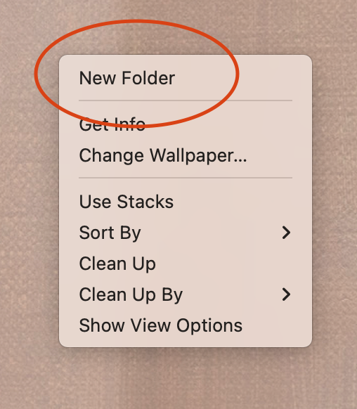
  

  

    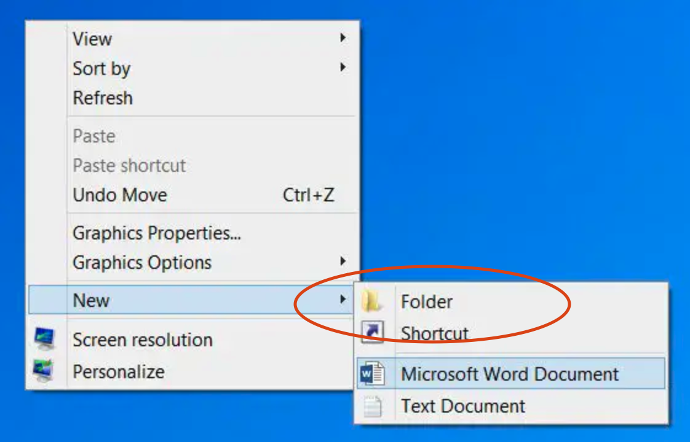
  

Name your folder `ReDI HTML and CSS`.

## Creating Files in Your Folder

There are many different ways to create new files - let's practice using VSCode to do so.

First, open VSCode. If you have trouble finding it, use your computer's search function (in the bar along the bottom of your screen on Windows, or the magnifying glass icon 🔍 in the top right corner on Mac).

Next, click "open":

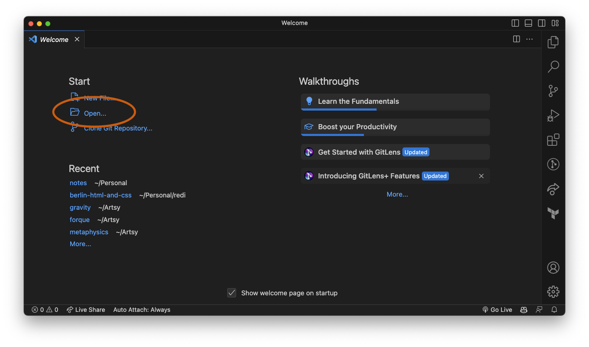

Then, find your `ReDI HTML and CSS` folder in the menu. If you can't find it, look for the folder called `Desktop` - `ReDI HTML and CSS` should be inside it.

Double click on that folder or click "open" to open it.

Now let's create some new files in your folder!

First, click on the "file explorer" icon:

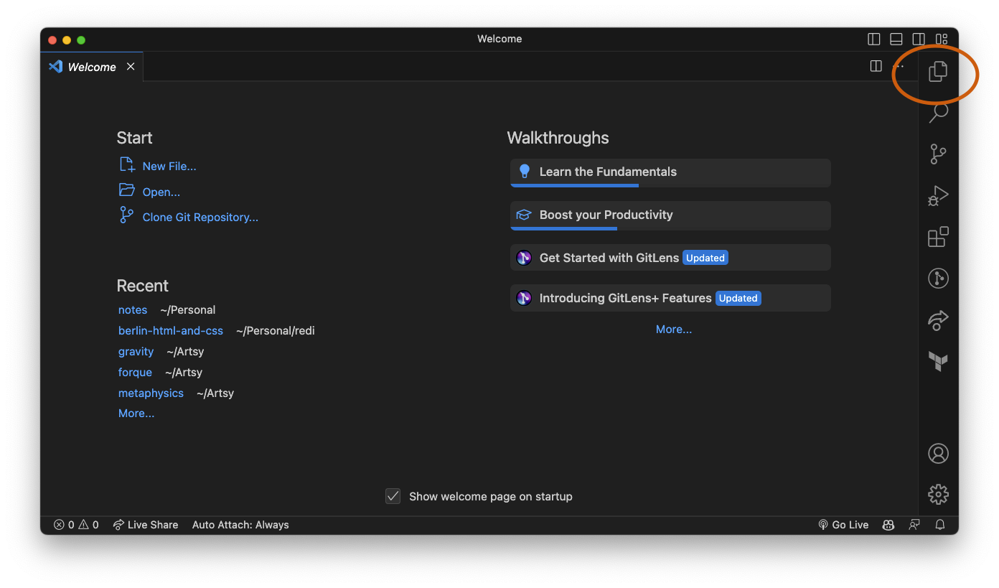

Next, click on the "new file" icon:

Type a name for your file. Two **VERY IMPORTANT NOTES:**

1. Your file name should not have any spaces. Use hyphens (`-`) or underscores (`_`) instead of spaces in the file name.
2. Your file name must end with `.html` (for HTML files) or `.css` (for CSS files)

For example, you could name your file `new_project.html` or `recipe-website.html` or `blog.html` or `lesson-11.html`.

You should now have a blank file in front of you. Nice work!

## Introducing the `<!DOCTYPE html>`, `<html>`, `<head>`, and `<body>` Tags

Every HTML file is a complete webpage. When we've written in CodePen, we've essentially been writing only the _content_ of the webpage, but there are actually more things that go into an HTML file than CodePen allows us to write.

There are 4 key pieces to every HTML document:

- `<!DOCTYPE html>`: always put this at the top of your HTML document, before anything else. There is no corresponding closing tag. For now, don't worry about why. It just needs to be there.
- `<html></html>`: this will be the parent element for everything else in your HTML.
- `<head></head>`: this goes inside the `<html>` tag and comes before any other tags. This is for things that are not visible content on the page, but that may impact it in other ways (like linking to a CSS file for your site!).
- `<body></body>`: this goes inside the `<html>` tag after the `</head>` closing tag. It contains all the visible content on the page. Everything we have written on CodePen has been treated as if it were inside a `<body>` tag.

So here is what a blank HTML document should always look like, before you add any other content:

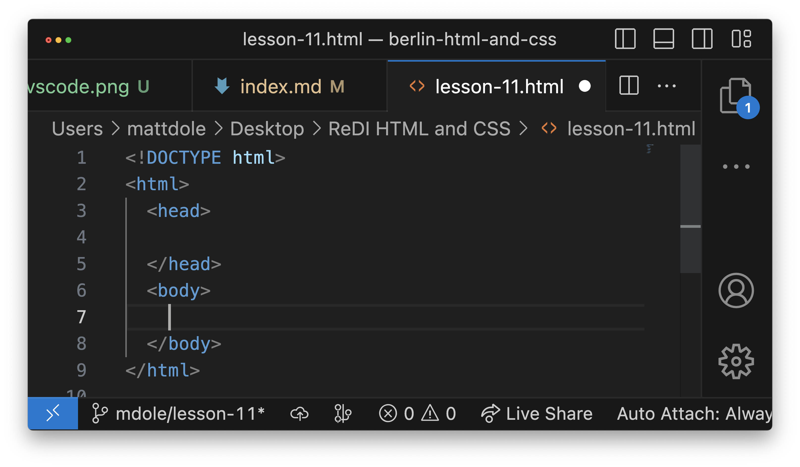

And we can start writing HTML in our `<body>` tag:

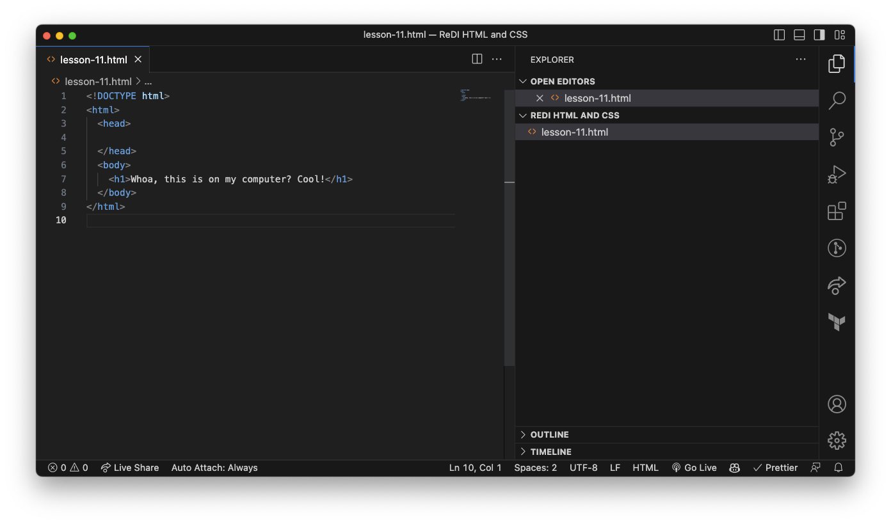

## Linking HTML and CSS files together

So now we've got an HTML file - what if we want to add CSS? We need to have a separate CSS file!

We can go through the same steps we went through to create an HTML file.

First, click on the "new file" icon to create a new file in this folder:

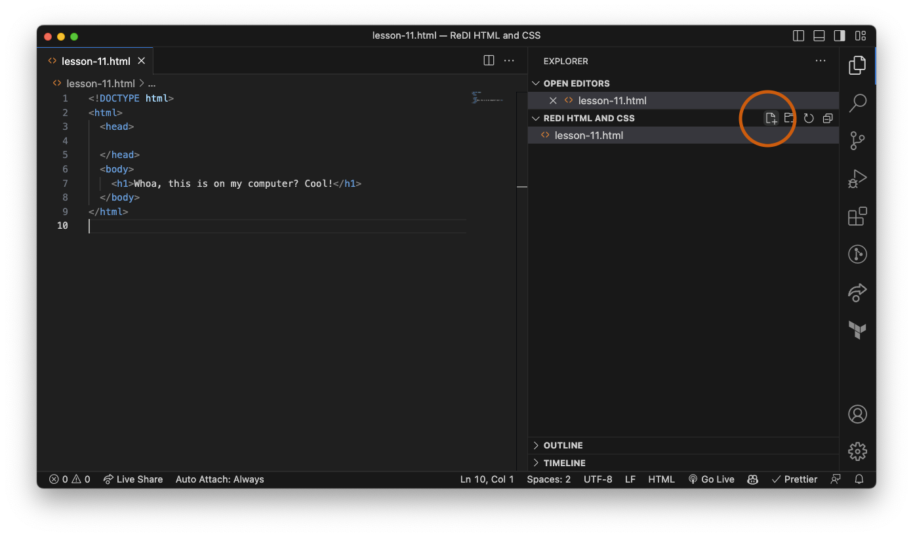

Next, name your file with a `.css` file extension:
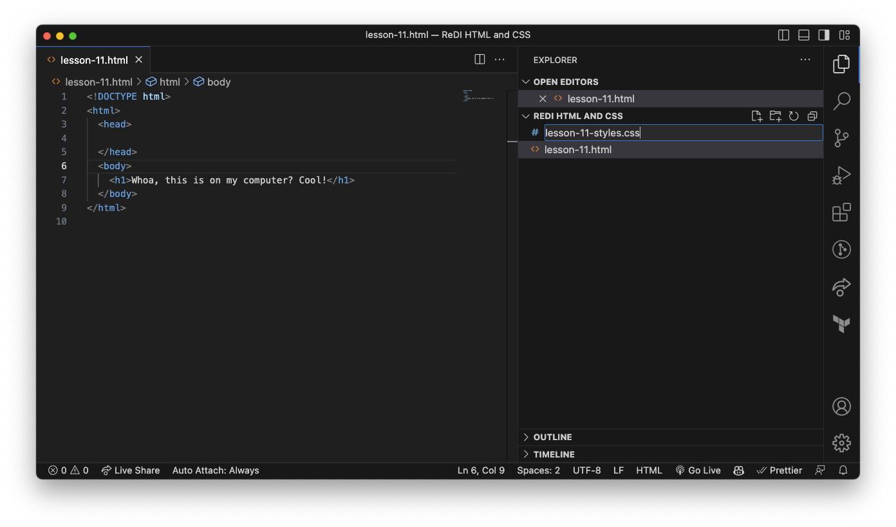

Next, write some CSS styles:
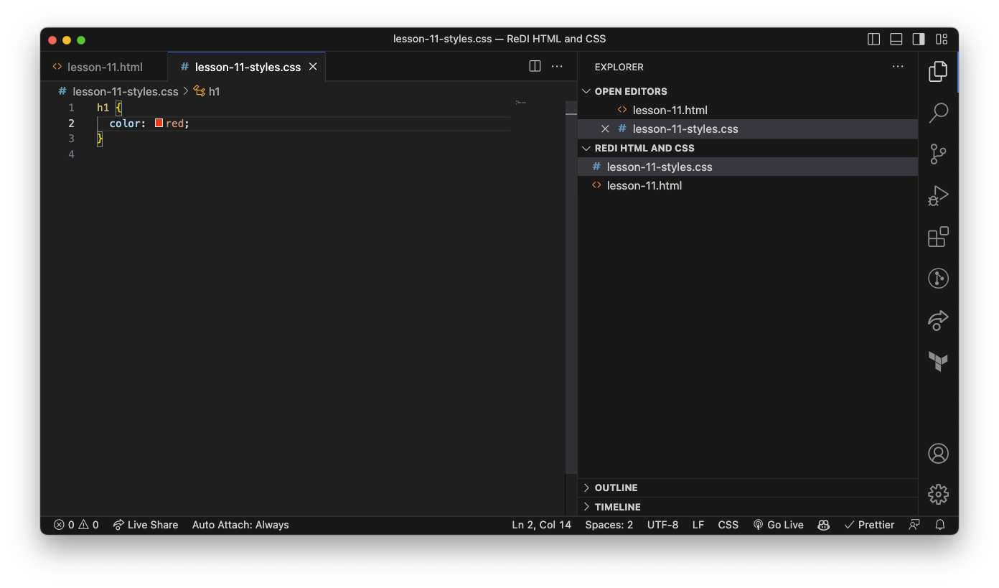

Last, we have to tell our HTML file where to find our new CSS file. To do so, we have to add a `<link>` tag to our `<head>` tag.

Our `<link>` tag has two important attributes: `rel` (short for "relationship") and `href`. `rel` will always be set to `"stylesheet"` when our link is to a stylesheet. We're telling the HTML file, "here is where you can find a CSS file that we should use to add styles to our page."

`href` will be set to the _location_ of our CSS file. If they are both in the same folder AND your file is called `lesson-11-styles.css`, it should just be `href="lesson-11-styles.css"`. The final product would look like this:
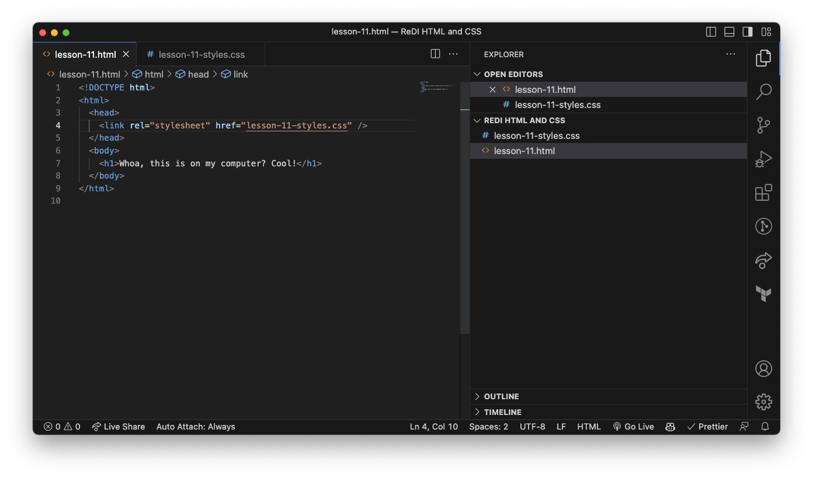

## Viewing Your New Page

OK, so we've created an HTML and CSS file and linked them together - but how do we view the result?

We need to open our HTML file using a web browser!

On your desktop, double-click your `ReDI HTML and CSS` folder to open it.

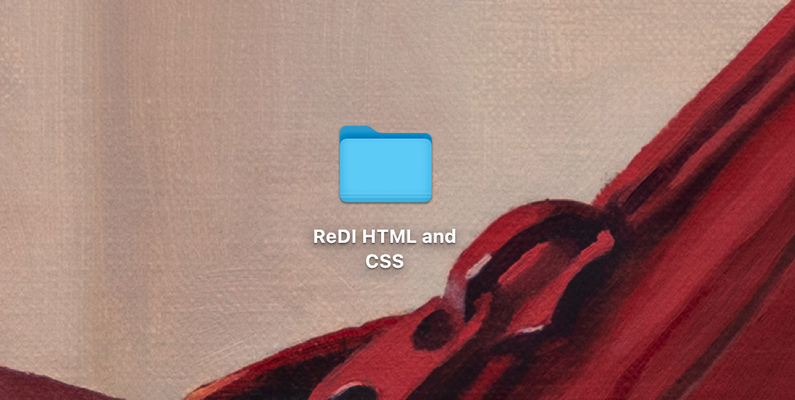

Inside the folder, you should see the HTML and CSS files you saved:
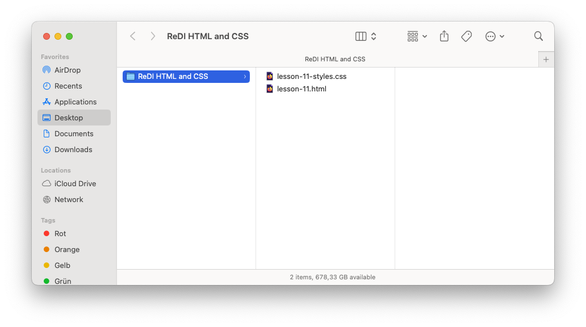

Double click the HTML file, or right click and select "open":
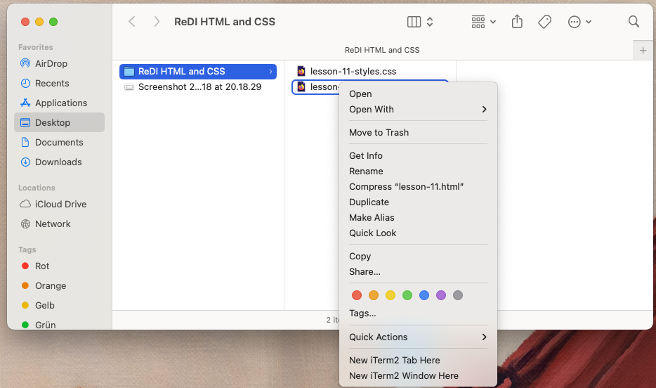

The file should open in your web browser!

To make changes to your HTML and view them, follow these steps:

1. Update your HTML in VSCode
2. Save your changes
3. Refresh your browser

That's it!

# Exercise

- [Change your theme](https://code.visualstudio.com/docs/getstarted/themes)
- Install the [Prettier extension](https://marketplace.visualstudio.com/items?itemName=esbenp.prettier-vscode) for automatic code formatting
- Create a second set of HTML + CSS files and link them
- Can you link multiple CSS stylesheets to one HTML file? Try it!
- Can you link multiple HTML files to one stylesheet? Try it!
- Can you download an image and display it locally? Try it!

# Homework

1. Make sure you are comfortable creating files and folders on your computer. Watch [Computer Skills Course: File Management, Part 1](https://www.youtube.com/watch?v=k-EID5_2D9U) and [Computer Skills Course: File Management, Part 2](https://www.youtube.com/watch?v=DGd48PGbnBs) if you are unsure or would like to review. Note that you can turn on subtitles if you're having a hard time understanding him or hear some new words you're not familiar with!
1. Watch [this YouTube](https://www.youtube.com/watch?v=BMT3JUWmqYY) video on file paths and write down notes/questions. If you prefer reading to watching, read [this article](https://medium.com/@Linda_Ikechukwu/understanding-file-paths-165c07ec5cf0). Or do both!
   It’s OK if this does not fully make sense yet! We’ll practice in class next week, and it takes time. Just get a start!

# Slides

<iframe src="https://docs.google.com/presentation/d/e/2PACX-1vT6WYqz9Q3dmvBzCmCYRXPTv4DoUMbnvKSNJXMN3Gl1CTKGvY86w5-JpEo9c9heJTFzq-Urf04YWdaw/embed" frameborder="0" width="960" height="569" allowfullscreen="true" mozallowfullscreen="true" webkitallowfullscreen="true"></iframe>
