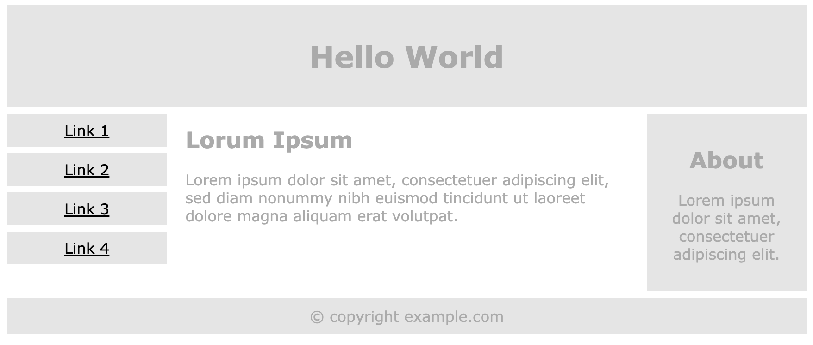

# Lesson 15 - Linking: Pages, Files, Fonts

## **Class Agenda**

1.  Introduction.
    
2.  Installing installing editor tools for HTML and CSS by VSCode extensions.
    
    1.  code formatting:
        
        1.  [autoprefixer](https://marketplace.visualstudio.com/items?itemName=mrmlnc.vscode-autoprefixer)
            
        2.  [prettier](https://marketplace.visualstudio.com/items?itemName=esbenp.prettier-vscode)
            
    2.  code correction:
        
        1.  [HTMLhint](https://marketplace.visualstudio.com/items?itemName=mkaufman.HTMLHint)
            
    3.  importing files:
        
        1.  [Relative path finder](https://marketplace.visualstudio.com/items?itemName=jakob101.RelativePath)
            
    4.  Image and color previews in CSS
        
        1.  [Image preview](https://marketplace.visualstudio.com/items?itemName=kisstkondoros.vscode-gutter-preview)
            
        2.  [Color Picker](https://marketplace.visualstudio.com/items?itemName=anseki.vscode-color)
            
3.  Setting up a new project structure.
    
4.  Linking between the files.
    
5.  Creating multiple HTML and CSS files and referencing it.
    
6.  Importing files with absolute and relative paths.
    
7.  Anchoring- linking to an element on the same page.
    
8.  Importing CSS files and organising global and utility classes.
    
9.  Specifying a downloadable font vs local fonts with CSS rule _@font-face._
    
10.  Importing images with _srcset/sizes_ attributes for responsive layouts.
    
11.  Break 10min
    
12.  Q&A
    
13.  Summary and classwork
    

## **Introduction**

The connections and associations between different elements in web projects are fundamental to crafting interconnected multi-page websites. In this class, we'll practice creating a new project and linking the files for communication between various components of a project.
### Installing development tools for HTML and CSS

In the previous class we've setup our Visual Studio Code editor- our new coding environment that is more advanced but powerful than CodePen. Today we will be installing essential tools to do a simple web development. The following editor extensions will supercharge our coding experience and enhance productivity. Reference to [Installing basic software](https://developer.mozilla.org/en-US/docs/Learn/Getting_started_with_the_web/Installing_basic_software).

### Setting up a new project structure

Next we will be setting up a project workspace and learn how to do it in VSCode. A website consists of many files: text content, code, stylesheets, media content, and so on. When you're building a website, you need to assemble these files into a structure on your local computer, make sure it can be readable one by another, and organise content that is maintainable before [uploading it to a server](https://developer.mozilla.org/en-US/docs/Learn/Getting_started_with_the_web/Publishing_your_website). [Dealing with files](https://developer.mozilla.org/en-US/docs/Learn/Getting_started_with_the_web/Dealing_with_files) discusses some issues you should be aware while setting up file structure for your website. 

### Linking between the files

Next we will be working with [hyperlinks](https://developer.mozilla.org/en-US/docs/Web/HTML/Element/a). Hyperlinks are important — it has been a feature of the Web since the Web has been created. Hyperlinks allow us to link documents to other documents or resources, link to specific parts of documents, or make apps available at a web address. Almost any web content can be converted to a link so that when clicked or otherwise activated the web browser goes to another web address ([URL](https://developer.mozilla.org/en-US/docs/Glossary/URL)). After creating the project structure we will learn how to communicate between the files with Hyperlinks, [reference to examples](https://developer.mozilla.org/en-US/docs/Learn/HTML/Introduction_to_HTML/Creating_hyperlinks).

```markup
<!DOCTYPE html>
<html lang="en">
<head>
  <meta charset="UTF-8">
  <meta name="viewport" content="width=device-width, initial-scale=1.0">
</head>
<body>
  <a class="active" href="/">Home</a>
  <a href="./products.html">Products</a>
</body>
</html>

```

### Creating multiple HTML and CSS files

The _link_ HTML element specifies relationships between the current document and an external resource. This element is most commonly used to link to stylesheets. We will practice how to organise CSS file structure and import stylesheets for multiple documents. We will also look at some [examples](https://developer.mozilla.org/en-US/docs/Web/HTML/Element/link) for performance and security features that are common to the linking elements such as _rel_ and _crossorigin_ attributes.

```markup
<link
  rel="preload"
  href="myFont.woff2"
  as="font"
  type="font/woff2"
 />

```

The _rel_ attribute defines the relationship between a linked resource and the current document. Valid on `<link>`, `<a>`, `<area>`, and `<form>`, the supported values depend on the element on which the attribute is found. When `rel` attribute is present, it must have a value that is an unordered set of unique space-separated keywords. The following [table](https://developer.mozilla.org/en-US/docs/Web/HTML/Attributes/rel) lists some of the most important existing keywords.

```markup
<link href="/media/examples/link-element-example.css" rel="stylesheet" />

<p>This text will be red as defined in the external stylesheet.</p>
<p style="color: blue">The <code>style</code> attribute can override it, though.</p>

```

_rel_ is also an HTML attribute that can be added to external links. It prevents the opening page to gain any kind of access to the original page for security reasons.

```markup
<a href="/en/”https://example.com”/" target="”_blank”" rel="”noopener" noreferrer”>Link</a>

```

More information about [rel=noopener noreferrer](https://wolf-of-seo.de/en/what-is/relnoopener-noreferrer/).

### Importing files with absolute and relative paths

_URL_ is one of the key concepts of the Web. It is the mechanism used by [browsers](https://developer.mozilla.org/en-US/docs/Glossary/Browser) to retrieve any published resource on the web. In theory, each valid URL points to a unique resource. Such resources can be an HTML page, a CSS document, an image, etc. In practice, there are some exceptions, the most common being a URL pointing to a resource that no longer exists or that has moved.

A URL is composed of different parts, some mandatory and others optional. The most important parts are highlighted on the URL below (details are provided in the following sections):

The required parts of a URL depend to a great extent on the context in which the URL is used. In your browser's address bar, a URL doesn't have any context, so you must provide a full (or _absolute_) URL.

When a URL is used within a document, such as in an HTML page, absolute url isn't necessary, because the browser already has the document's own URL, it can use this information to fill in the missing parts of any URL available inside that document. We can differentiate between an _absolute URL_ and a _relative URL_ by looking only at the _path_ part of the URL.

### Anchoring- linking to an element on the same page.

The URL that the hyperlink points to from [anchor](https://developer.mozilla.org/en-US/docs/Web/HTML/Element/a) elements can use any URL scheme supported by browsers:

*   Sections of a page with document fragments
    
*   Specific text portions with [text fragments](https://developer.mozilla.org/en-US/docs/Web/Text_fragments)
    
*   Pieces of media files with media fragments
    
*   Telephone numbers with `tel:` URLs
    
*   Email addresses with `mailto:` URLs
    
*   SMS text messages with `sms:` URLs
    

#### Linking to an element on the same page

```markup
<!-- <a> element links to the section below -->
<p><a href="#Section_further_down">Jump to the heading below</a></p>

<!-- Heading to link to -->
<h2 id="Section_further_down">Section further down</h2>

```

The anchoring in HTML is commonly used in TOC (Table Of Contents) navigation.

### Importing CSS files and organising global and utility classes

As we already know, classes differ from the other global styling methods in terms of their portability: you can use classes between different HTML elements and their types. This allows us to diverge from inherited, universal, and element styles _globally_. We will look at the examples of utility-first CSS frameworks. We will try to inspect our previous files created with utility classes in CSS and learn with the practice- only generate the minimum classes needed and reduce the waste in CSS. Here is a useful [article](https://every-layout.dev/rudiments/global-and-local-styling/) about global vs local styling, and information here about [global CSS frameworks](https://blog.logrocket.com/css-utility-classes-library-extendable-styles/).


#### Top-level vs element and block-level styles

“top-level” we mean styles that are applied globally on the root elements `<html>` as well as the `<body>`. These styles are “top-level” in the sense they are inherited styling of all documents by default.

The classic example in CSS is setting a default font size on the `<body>` element or headings. A useful add-on to the global styles are [Normalize.css](https://necolas.github.io/normalize.css/) CSS resets. _Normalize_._css_ makes browsers render all elements more consistently and in line with modern standards.

What if we want to scope that top-level font-size to a specific element? A global element is a little tricky to understand because they are both blocks and blocks that can be nested in other blocks, therefore your CSS properties might be overwritten based on specificity rules.

#### Block-level design

In order to organise class names think of elements as “core” blocks. Core blocks can be understood as a basic sections of a document. Webpages looks so different from one another, but they all tend to share similar standard components, unless the page is badly structured. A heading is a perfect example of a core block, Look for the other examples:

**header:**

Usually a big strip across the top with a big heading, logo, and perhaps a tagline. This usually stays the same from one webpage to another.

**navigation bar:**

Links to the site's main sections; usually represented by menu buttons, links, or tabs. Like the header, this content usually remains consistent from one webpage to another — having inconsistent navigation on your website will just lead to confused, frustrated users. Many web designers consider the navigation bar to be part of the header rather than an individual component, but that's not a requirement; in fact, some also argue that having the two separate is better for accessibility, as screen readers can read the two features better if they are separate.

**main content:**

A big area in the center that contains most of the unique content of a given webpage, for example, the video you want to watch, or the main story you're reading, or the map you want to view, or the news headlines, etc. This is the one part of the website that definitely will vary from page to page!

**sidebar:**

Some peripheral info, links, quotes, ads, etc. Usually, this is contextual to what is contained in the main content (for example on a news article page, the sidebar might contain the author's bio, or links to related articles) but there are also cases where you'll find some recurring elements like a secondary navigation system.

**footer:**

A strip across the bottom of the page that generally contains fine print, copyright notices, or contact info. It's a place to put common information (like the header) but usually, that information is not critical or secondary to the website itself. The footer is also sometimes used for SEO purposes, by providing links for quick access to popular content.



Reference from [Responsive Web W3](https://www.w3schools.com/html/tryit.asp?filename=tryhtml_responsive_media_query3)

In block-level design each element block has one classname that can be shared across multiple HTML documents.

```markup
<! -- index.html --> 
<!DOCTYPE html>
<html lang="en">
<head>
  <meta charset="UTF-8">
  <meta name="viewport" content="width=device-width, initial-scale=1.0">
  <link rel="stylesheet" href="main.css">
</head>
<body>
<div class="sidebar">
  <a class="active" href="#home">Home</a>
  <a href="#news">News</a>
  <a href="#contact">Contact</a>
  <a href="#about">About</a>
</div>
</body>

```

```markup
/* main.css */ 
.sidebar {
  margin: 0;
  padding: 0;
  width: 200px;
  background-color: #f1f1f1;
  position: fixed;
  height: 100%;
  overflow: auto;
}

.sidebar a {
  display: block;
  color: black;
  padding: 16px;
  text-decoration: none;
}

.sidebar a.active {
  background-color: #04AA6D;
  color: white;
}

.sidebar a:hover:not(.active) {
  background-color: #555;
  color: white;
}

```

For global or top-level styles it is common to apply css properties for tag elements, for example [typography](https://cssreference.io/typography/) design (_font-family_, \_font\_-_weight,_ _color_, _line-height_, _text-decoration_) for text elements such as h1 to h6, paragraphs and anchors;

```markup
/* global.css */ 
body {
  line-height: initial;
  font-size: 17px;
}
div {
  line-height: 1.25;
  font-size: inherit;
}  
div p {
  font-size: 16px;
}

```

### Specifying a downloadable vs local fonts with CSS rule _@font-face_

The `@font-face` [CSS](https://developer.mozilla.org/en-US/docs/Web/CSS) [at-rule](https://developer.mozilla.org/en-US/docs/Web/CSS/At-rule) specifies a custom font with which to display text; the font can be loaded from either a remote server or a locally-installed font on the user's own computer. We will see [how to download fonts locally or link it remotely](https://developer.mozilla.org/en-US/docs/Web/CSS/@font-face) from web server. By allowing authors to provide their own fonts, `@font-face` makes it possible to design content without being limited to the so-called "web-safe" fonts (that is, the fonts which are so common that they're considered to be universally available). The ability to specify the name of a locally-installed font to look for and use makes it possible to customize the font beyond the basics while making it possible to do so without relying on an internet connection.

```markup
@font-face {
  font-family: myFirstFont;
  src: url(sansation_light.woff);
}

div {
  font-family: myFirstFont;
}
```

### Creating responsive layouts from images with _srcset/sizes_ attributes

We will also learn how to create responsive images by linking different image files with `` _src_ and _srcset_ attributes, or using CSS background images with Permalink to image-set() for resolution switching. [CSS arguably has better tools for responsive design](https://cloudfour.com/thinks/responsive-images-101-part-8-css-images/) than HTML.

## Classwork

1.  Open the Visual Studio Code and follow the links from the agenda to find the extensions and install them on editor.
    
2.  Setup project structure and create directories for resources: _pages_, and _public_ folder, and inside _public_ create folder for _images_ and _styles_
    
3.  Create one index.html file and two html files in _documents_ folder one _products.html_ and _productDetails.html_, link it from _index.html_ with the hyperlinks.
    
4.  Create two CSS files and save it in _styles_ folder, name it to _global.css_, _main.css_
    
    1.  Download [normalize.css](https://necolas.github.io/normalize.css/8.0.1/normalize.css) and save it to the _styles_ folder.
        
    2.  In _global.css_ add _font-size: 1.125rem;_ to the _body_ element.
        
    3.  In _main.css_ create a CSS classnames with block-level styles for the sidebar navigation, [code example from W3 for sidebar](https://www.w3schools.com/howto/tryit.asp?filename=tryhow_css_sidebar_responsive).
        
    4.  Link _global.css_, _main.css_, _normalize.css_ files from the _index.html, products.html_ and _productDetails.html_
        
5.  Add one sidebar navigation in HTML with class names from _main_.css on landing page _index.html_ and copy/paste it also on _products.html_ and _productDetails.html._ Use CSS properties `position: fixed;` to stick the navigation to the page. Add more text or height to have make scrolling visible.
    
6.  Link the sidebar navigation items to relative URL _products.html_ and absolute URL (external url such as [https://www.tchibo.de/kaffee-aus-100-arabica-bohnen-vollkommener-kaffeegenuss-bei-t-c4.html)](https://www.tchibo.de/kaffee-aus-100-arabica-bohnen-vollkommener-kaffeegenuss-bei-t-c4.html))
    
7.  Select one of the custom fonts (i.e. Google fonts) and link it to _index.html_ via _link_ tag\_.\_ for instance [Quicksand](https://fonts.google.com/specimen/Quicksand) font family. Apply the the font family for all anchor elements in _global.css_ stylesheet, e.g. `font-family: 'Quicksand', sans-serif;`
    

## Homework

Download any font from Google fonts or other font service and save it to the _font_s folder. Link the downloaded fonts to the _global.css_ file with _@font-face_ CSS rule to be able to use custom _font-family_ from locally-installed fonts.