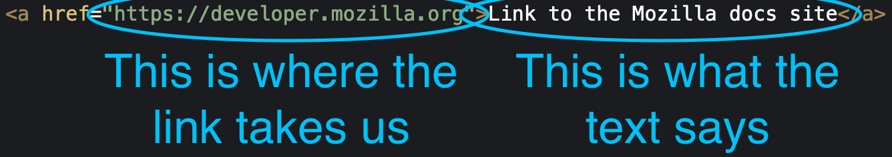
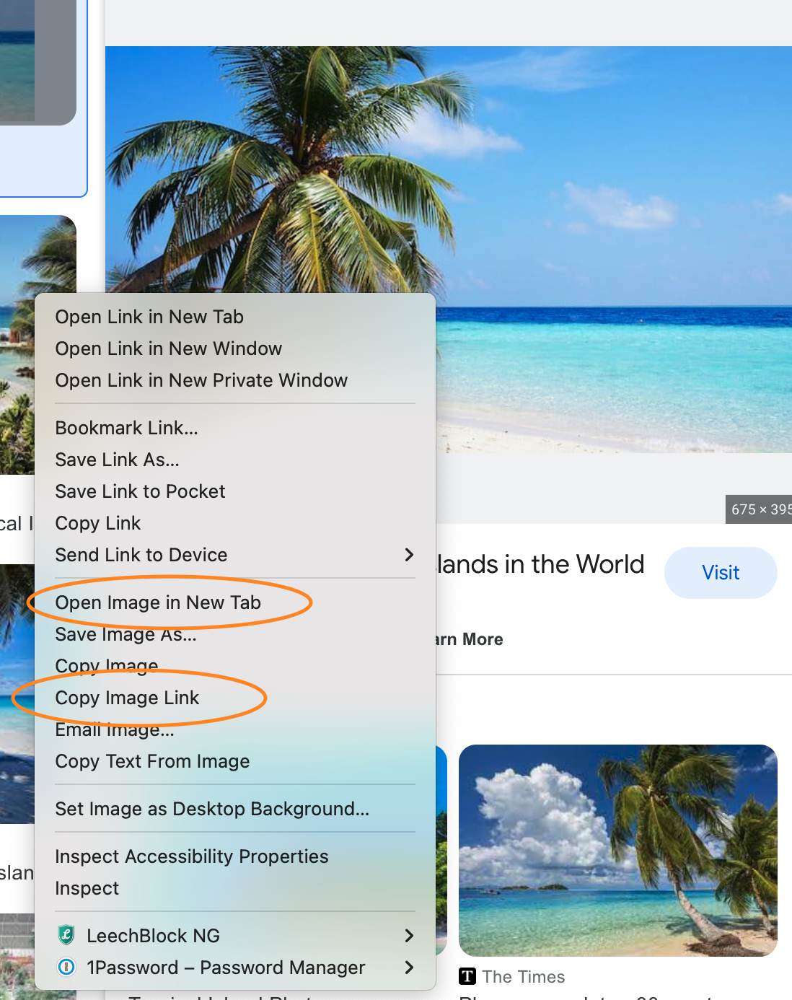
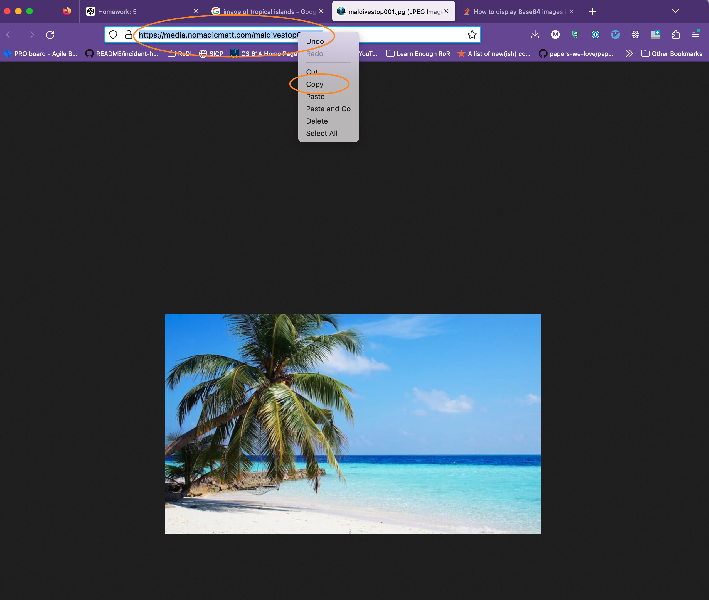
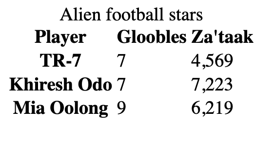
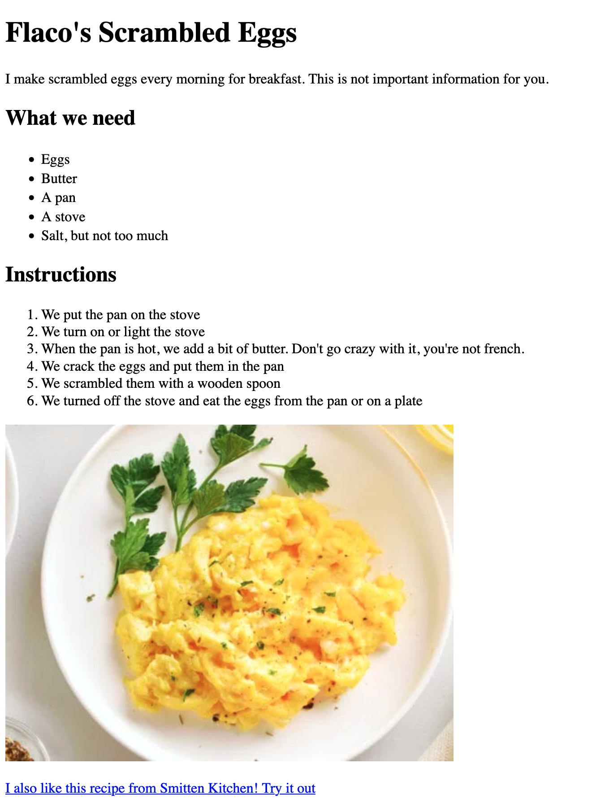

# HTML Attributes & More Tags

## Class Agenda

- `` and `<a>` elements
- Common HTML attributes
- Making tables with HTML

# Images and Links

Two of the most common HTML elements are the `<a></a>` element, used to create links between pages, and the `` element, which is used to display images.

## The `<a>` element

Every time we write HTML, we are creating a "page." https://developer.mozilla.org is a page. https://developer.mozilla.org/en-US/docs/Web/HTML is another page, and https://developer.mozilla.org/en-US/docs/Web/CSS is a third page.

A "link" between pages allows you to click and be taken to that page. In the previous paragraph, we reference https://developer.mozilla.org - but it's not a _link_, because you can't click on it. Here's a link that takes you to that site: [https://developer.mozilla.org](https://developer.mozilla.org).

To construct a link, we need to know two things:

1. Where should the link take us when we click on it? This is called the _destination_.
2. What should the text of the link say? This is the _content_ of the element.

For example, here's a link to that same site, but it says "Link to the Mozilla docs site" instead of "https://developer.mozilla.org":

[Link to the Mozilla docs site](https://developer.mozilla.org)

Clicking the link takes you to the same place, but it says something different.

To create a link, we have to use an **HTML attribute**.

HTML attributes are added to the opening tag of an HTML element, and they modify the behavior of the element. The attribute we use to set the destination of the link is called `href`.

Here's an example:



By adding `href="https://developer.mozilla.org"` to the opening `<a>` tag, we set the destination of the link to be `https://developer.mozilla.org`. And by adding the text `Link to the Mozilla docs site` between the opening and closing `<a></a>` tags, we make the link say `Link to the Mozilla docs site`.

If we did not add an `href` attribute to our link, it would not be a link! We would have no destination, so we could not click it. The `href` attribute is required to create a link.

You can't add an `href` attribute to most other elements. For example, this does not create a link: `<p href="https://developer.mozilla.org">This is not a link!</p>`.

Let's do another example of HTML attributes with `` tags!

## The `` element

Just like `<a>` elements, `` elements require an HTML attribute to function.

To display an image, we have to use the `src` attribute to set the _source_ of the image. In other words, we want to show an image - which image? Where does it come from?

When we set the `src` attribute, we are saying, "display the image that is at this link."

Here's an example:

``

If you visit [https://upload.wikimedia.org/wikipedia/commons/thumb/7/7b/M%C3%BCnster%2C*Observantenkirche*--_2021_--_9112.jpg/2560px-M%C3%BCnster%2C_Observantenkirche_--_2021_--\_9112.jpg](https://upload.wikimedia.org/wikipedia/commons/thumb/7/7b/M%C3%BCnster%2C_Observantenkirche_--_2021_--_9112.jpg/2560px-M%C3%BCnster%2C_Observantenkirche_--_2021_--_9112.jpg), you will see a page with nothing but a single image.

By setting our `src` attribute to that link, we display that image. **Note that it is only possible to use a link as a `src` if the link is for a page with nothing but an image!** For example, this will not work: `` because `https://google.com` is a page with lots of content, and not just an image on it.

Note that images are _void elements_, as discussed in Lesson 3, which means they have no closing tag or contents. You simply create an `` tag and add a `src` attribute to it, and you're done!

### Finding images

Here is how you can get a URL/link for an image to put in the `src` attribute:

To get the link to the image, you can search for an image on Google and right-click on it. Then you can select "Copy image link" or "Open image in new tab." Here's an example:



Note that depending on which browser you use, such as Chrome, Safari, Firefox, or Edge, the options in the menu may be slightly different.

If you select "Open image in new tab," you should then copy the URL from the address bar in your browser by right-clicking and selecting "copy". Here's an example:



Either way, if you then use paste, you should see a URL like `https://media.nomadicmatt.com/maldivestop001.jpg`. You can put that in your src= attribute, and the image should appear.

# Common HTML attributes

`src` and `href` are two HTML attributes - what are some others?

`class` and `id` are probably the two most widely-used HTML attributes. We're not going to talk about them yet because they are mostly used for CSS styling or JavaScript functionality.

There are many other attributes ([here is a full list](https://developer.mozilla.org/en-US/docs/Web/HTML/Attributes)), but those four are enough to create complex and beautiful websites. Memorize them and get lots of practice using them!

```html
<a href="https://google.com">Link to google</a>

<div class="full-width-image-container">...</div>
<div id="homepage-hero-carousel">...</div>
```

# HTML Tables

A table can be a helpful way to present information in _rows_ and _columns_, and creating them is good practice for using HTML nesting.

To create a table, start with a `<table>` tag. _Inside_ that tag, you should then add `<tr>` (short for "table row") tags to create rows, a `<thead>` (short for "table header") to designate one of the rows as the header, `<th>` (also short for "table head") tags to create cells within your table header, and `<td>` (short for "table data") tags to create individual cells within your table.

Here's an example:

```html
<table>
  <caption>
    Alien football stars
  </caption>
  <tr>
    <th>Player</th>
    <th>Gloobles</th>
    <th>Za'taak</th>
  </tr>
  <tr>
    <th>TR-7</th>
    <td>7</td>
    <td>4,569</td>
  </tr>
  <tr>
    <th>Khiresh Odo</th>
    <td>7</td>
    <td>7,223</td>
  </tr>
  <tr>
    <th>Mia Oolong</th>
    <td>9</td>
    <td>6,219</td>
  </tr>
</table>
<!-- Source: https://developer.mozilla.org/en-US/docs/Web/HTML/Element/th -->
```

Which creates the following output:



# Homework

Write a recipe using HTML!

Do _not_ copy an existing CodePen and edit it. Instead, create a new one and get practice starting from scratch.

Your recipe should include:

- At least two headings (using `h1`, `h2`, `h3`, `h4`, `h5`, or `h6` tags)
- A paragraph saying why you like the recipe (using `<p>`)
- An unordered list of ingredients (using `<ul>` and `<li>`)
- An ordered list of steps to follow (using `<ol>` and `<li>`)
- An image of the food (using the `` tag). You can follow the instructions in the [section on the img element](#the-img-element) to find an image to use
- A link to someone else's version of the recipe (using `<a>`)

Here is an image of what your recipe could look like:



## Optional extra homework

If you want more practice with HTML tables, complete this exercise:

[https://codepen.io/redi-school/pen/WNgVQoE](https://codepen.io/redi-school/pen/WNgVQoE)
