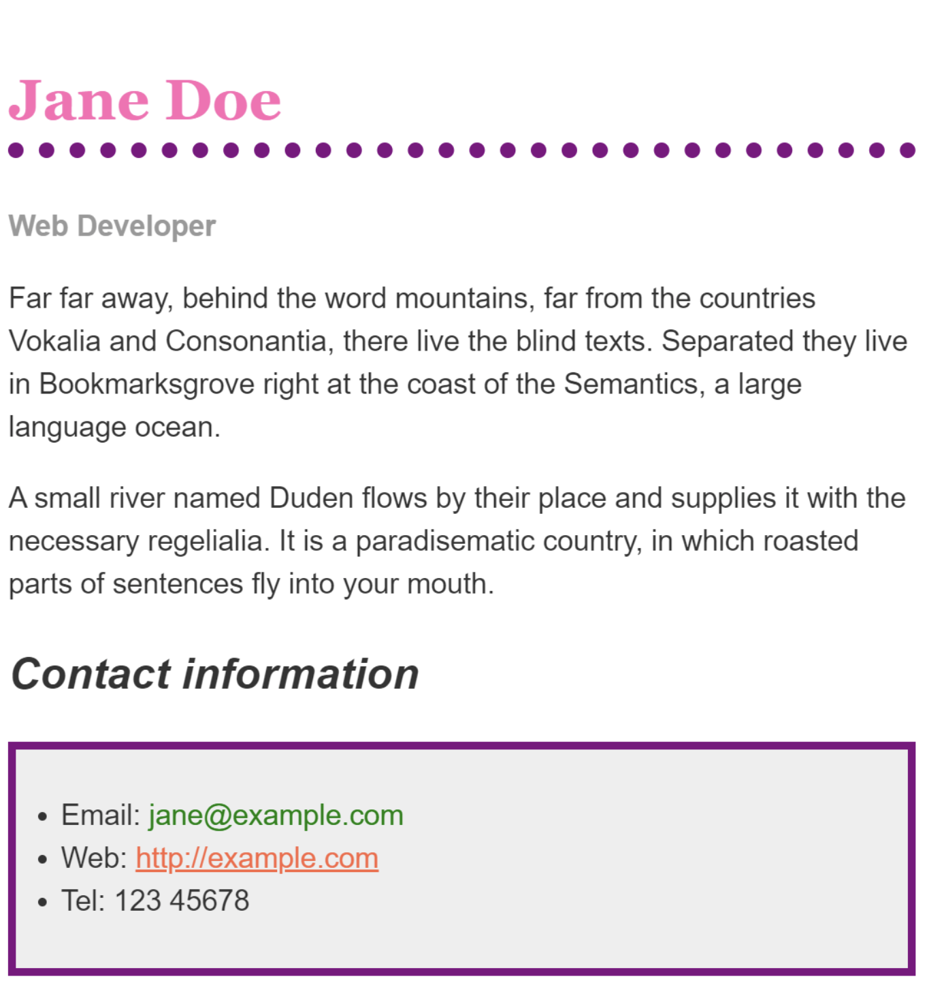

# Introduction to CSS

## Class Agenda

1. Recap of HTML tags & attributes
2. 40 minutes: Create a new HTML file that uses all of the tags listed in the recap & ask questions
3. Write our first CSS styles

## 1. Recap: HTML tags & attributes

### HTML tags

- `<html></html>`
- `<head></head>`
- `<body></body>`
- `<h1></h1>, <h2></h2>...<h6></h6>`
- `<p></p>`
- `<div></div>`
- `<ol></ol>, <ul></ul>, <li></li>`
- ``
- `<a></a>`
- …lots more!

### HTML attributes

- Always inside the opening tag
- Modifies the behavior of the element
- Format: `attributename="attribute-value"`
- Examples:
  - `<a href="https://google.com">Link to google</a>`
  - ``
  - `<div hidden="true">I'm invisible!</div>`
  - `<div class="full-width-image-container">...</div>`
  - `<div id="homepage-hero-carousel">...</div>`

## 2. CSS Basics

To use CSS to style your HTML, always follow four steps:

1. _Create_ a .css file
1. _Connect_ your .css file to your .html file
1. _Select_ elements
1. _Apply_ styles to those elements

### Creating a CSS file

The same way you have created .html files, create a new file called style.css.

Make sure it is in the same folder as your .html file!

### Connecting your CSS to your HTML

Inside your .html file's `<head></head>` tag, add a new `<link />` tag:

```html
<head>
  <link href="style.css" rel="stylesheet" />
</head>
```

### Selecting HTML elements

- We use CSS selectors to determine which HTML elements a style should apply to
- There are many different types of CSS selectors. The ones we'll focus on today are elements (like `p`, `h1`, `div`, etc.), class name, and ID
- The syntax of CSS is:

```css
your-selector-goes-here {
  property-name: property-value;
}
```

- Example with element selector:

```css
h1 {
}
```

- Example with class selector:

```css
.red-text {
}
```

- Example with ID selector:

```css
#red-header {
}
```

### Applying styles to the selected elements

- First you write the property you want to change, then a colon (`:`), then the value you want it to have, then a semicolon (`;`)

```css
.red-header {
  color: red;
}
```

- In this case, we have:
  - Selected all elements with `class="red-header"`
  - Chosen the `color` property
  - Set the `color` property to be `red`

# Exercise Description

1. _Create_ a .css file
1. _Connect_ your .css file to your .html file
1. _Select_ elements
1. _Apply_ styles to those elements

# Glossary & Terminology

- CSS Selector: A CSS selector is the first part of a CSS Rule. It is a pattern of elements and other terms that tell the browser which HTML elements should be selected to have the CSS property values inside the rule applied to them. More on this [here](https://developer.mozilla.org/en-US/docs/Learn/CSS/Building_blocks/Selectors#what_is_a_selector).

# Homework

1. Create new HTML and CSS files
1. Link them together
1. Visit this page: https://developer.mozilla.org/en-US/docs/Learn/CSS/First_steps/Styling_a_biography_page
1. Copy the CSS from the interactive editor (bottom of page) into your .css file
1. Copy the HTML from the interactive editor into your .html file
1. Update the CSS until your page looks like the image below



# Resources

- [How to add CSS to HTML](https://www.w3schools.com/css/css_howto.asp)
- [CSS selectors](https://www.w3schools.com/css/css_selectors.asp)

# Slides

<iframe src="https://docs.google.com/presentation/d/e/2PACX-1vSu5nyjXiuL95InwXE2ut10Jnu9zqT9bFwmJYpjPI9ihblyIxFC48qr84iioeAYAZuNlkPDOZk1giOH/embed" frameborder="0" width="960" height="569" allowfullscreen="true" mozallowfullscreen="true" webkitallowfullscreen="true"></iframe>
