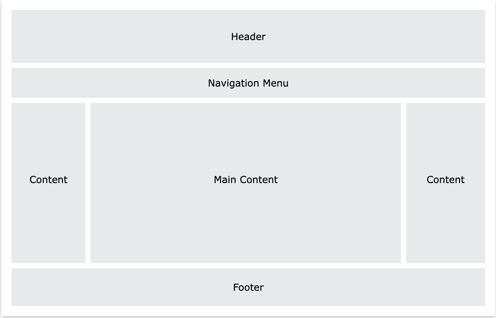

# CSS Layout

## Class Agenda

1. Introduction to CSS layout & the "normal flow"
2. Introduction to flexbox

## Introduction to CSS Layout

A website is divided into different parts, that together add to a layout. E.g. you have a header, a footer, navigation and main and side-content. All this needs can be structured with CSS.

You can use various techniques in CSS to control the layout.
We will focus mainly on

- The flow layout
- Flexbox
- Grid

There are other techniques, like positioning and using the table for layouting, which is not used anymore nowadays with more modern approaches. If you are curious, you can find some more on the history of CSS layouting [here](https://dev.to/dianale/css-layouts-history-from-float-to-flexbox-and-grid-5af7)

## Display property

The most frequently used values of the `display` property are:

- `display: block`
- `display: inline`
- `display: inline-block`
- `display: flex`
- `display: grid`
- `display: none`

The display property defines how an element is treated on your website in regards to layout.
The values `block`, `inline` and `inline-block`, are using the [Flow Layout](https://developer.mozilla.org/en-US/docs/Web/CSS/CSS_Flow_Layout) while flex and grid have their own layout system.

## Flow layout with block, inline and inline-block

### display: inline

- `inline` elements behave like words in a sentence.
- They sit next to each other in the inline direction.
- You can't set an explicit width and height on inline elements. Any block level margin and padding will be ignored by the surrounding elements.
- Elements such as \<span\>, \<a\>, \<strong\>, are inline by default.

#### display: block

- `block` elements create a new line for themselves.
- A block element will expand to the full width by default.
- The margin, width and height on all sides of a block element can be added
- Elements such as \<div\>, \<h1\> and \<p\> (paragraph), are block by default.

#### display: inline-block

- `inline-block` combines features of both inline and block elements
- Inline-block elements can appear next to each other and we can set their dimensions using the width and height properties.
- \ are the best example of default inline-block elements

You can play around with [this example](https://codepen.io/redi-school/pen/WNarxpY) and solve [this exercise](https://codepen.io/redi-school/pen/wvYMWdE)

## Quiz

[Here](https://create.kahoot.it/share/berlin-html-css-s23-lesson-9/82fefecc-3845-483f-8759-dba7668d3f7e) a small quiz to test your knowledge.

## Introduction to Flexbox

Flexbox is a comparatively newer way to layout elements on the page without the limits and frustration of Floats like:

- You have to clear Floats (when the containing element collapses).
- Sometimes have to change the order of your HTML to achieve a Floats design.

Flexbox layout makes it easier to design flexible responsive layout structure (hint: Flexbox = flexible boxes).

With flexbox, you can align elements horizontally and vertically. Unlike floats, you can re-order flex items without needing to change the HTML.

### The Flex Model

- `flex` is the value for the display property that activates the Flexbox layout on an element.
- What is a flex container?
- What are flex items?
- What are the most common properties that can be used on a flex container?
  - `flex-direction` (default `row`)
  - `flex-wrap` (default `nowrap`)
  - `justify-content` (default: `flex-start`)
  - `align-items` (default: `stretch`)
  - `align-content` (default: `stretch`)
  - `flex-flow`
- What are the most common properties that can be used on a flex item?
  - `align-self` is similar to `align-items` on the container, but applies to a single flex item.
  - `flex`: shorthand property for the `flex-grow`, `flex-shrink`, and `flex-basis`
  - `flex-grow`: specifies how an item grows when it is allowed to take extra space available in the container (default: 0)
  - `flex-shrink` specifies how an item shrinks when there is not enough space available in the container (default: 1)
  - flex-basis
  - order

## [Example](https://codepen.io/redi-school/pen/eYPJzRY)

## Exercises

1. Practice using Flexbox with this [codepen](https://codepen.io/redi-school/pen/rNoRXrv)

## Quiz

[Flexbox quiz!](https://create.kahoot.it/creator/aee4f0bd-34b4-451d-ae52-c6f7d1563dd8)

# Homework

- Finish [the exercise we started in class today](https://codepen.io/redi-school/pen/rNoRXrv)
- Try [Flexbox Froggy](https://flexboxfroggy.com/). See if you can get through levels 1 - 13!
- If you finish that and want more practice, here's another [exercise](https://codepen.io/redi-school/pen/jOeWrvj)

# Resources

- [The CSS Box Model Explained by Living in a Boring Suburban Neighborhood](https://www.freecodecamp.org/news/css-box-model-explained-by-living-in-a-boring-suburban-neighborhood-9a9e692773c1)
- [CSS Layout](https://www.smashingmagazine.com/2018/05/guide-css-layout/)
- [History of CSS Layout](https://dev.to/dianale/css-layouts-history-from-float-to-flexbox-and-grid-5af7)
- [Slides](https://docs.google.com/presentation/d/1-lUopHb5vePTrahBO0XBxU4MD4H07ybszNUS8CFx0To/edit?usp=sharing)

# Slides

<iframe src="https://docs.google.com/presentation/d/e/2PACX-1vRI4Qx7iXj9mq0zk6CnKq7m7BRmfvj_E7SHevgu7PNCDHsYzenSbGcBdArmN9KCXkcmXMs_bCy_M_2v/embed" frameborder="0" width="960" height="569" allowfullscreen="true" mozallowfullscreen="true" webkitallowfullscreen="true"></iframe>
